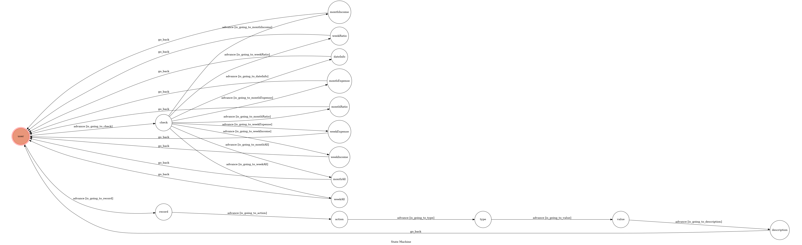

# A linebot that tracks your money

> If you want to be rich, you need to be accountable for your money first.

## Introduction

It's an user friendly linebot based on finite state machine.

Its goal is to help you to track your money easily.

Hence, it got lots of buttons to stop you from tiredly typing your transaction information.

## Add me to start your journey !


Line id : @275yfsdf

## Main menu
Click `查詢` to ckeck your transaction history, or click `記帳` to record a new transaction.


## 記帳
When you click `記帳`, it'll show you a menu for you to choose which kind of transaction you want to record (expense or income).


Next, you can choose a specific type of your transaction, `食、衣、住、行、育、樂` in expense, `薪資、獎金、投資、零用錢` in income.


Then type in the transaction value and some description.


## 查詢
When you click `查詢`, it'll show you a menu to pick which kind of history you want to look.

There are three types of history you can look up, which are single day, this week, and this month.

If you choose single day, it'll show you a menu for you to pick which day's information you want to look up.


If you choose to see week or month information, there are 4 kinds of information you can choose.


* `收入結構` -> It'll show you a pie chart of income structure.


* `支出結構` -> It'll show you a pie chart of expense structure.


* `收支比例` -> It'll show you a pie chart of ratio of expense and income.


* `各項金額` -> It'll show you a bar chart of every kind of transaction.


## FSM graph


## Project Setup

### Prerequisite
* Python 3.6
* Pipenv
* Facebook Page and App
* HTTPS Server

#### Install Dependency
```sh
pip3 install pipenv

pipenv --three

pipenv install

pipenv shell
```

* pygraphviz (For visualizing Finite State Machine)
    * [Setup pygraphviz on Ubuntu](http://www.jianshu.com/p/a3da7ecc5303)
	* [Note: macOS Install error](https://github.com/pygraphviz/pygraphviz/issues/100)


#### Secret Data
You should generate a `.env` file to set Environment Variables refer to our `.env.sample`.
`LINE_CHANNEL_SECRET` and `LINE_CHANNEL_ACCESS_TOKEN` **MUST** be set to proper values.
Otherwise, you might not be able to run your code.

#### Run Locally
You can either setup https server or using `ngrok` as a proxy.

#### a. Ngrok installation
* [ macOS, Windows, Linux](https://ngrok.com/download)

or you can use Homebrew (MAC)
```sh
brew cask install ngrok
```

**`ngrok` would be used in the following instruction**

```sh
ngrok http 8000
```

After that, `ngrok` would generate a https URL.

#### Run the sever

```sh
python3 app.py
```

#### b. Servo

Or You can use [servo](http://serveo.net/) to expose local servers to the internet.


## Finite State Machine


## Usage
The initial state is set to `user`.

Every time `user` state is triggered to `advance` to another state, it will `go_back` to `user` state after the bot replies corresponding message.

* user
	* Input: "go to state1"
		* Reply: "I'm entering state1"

	* Input: "go to state2"
		* Reply: "I'm entering state2"

## Deploy
Setting to deploy webhooks on Heroku.

### Heroku CLI installation

* [macOS, Windows](https://devcenter.heroku.com/articles/heroku-cli)

or you can use Homebrew (MAC)
```sh
brew tap heroku/brew && brew install heroku
```

or you can use Snap (Ubuntu 16+)
```sh
sudo snap install --classic heroku
```

### Connect to Heroku

1. Register Heroku: https://signup.heroku.com

2. Create Heroku project from website

3. CLI Login

	`heroku login`

### Upload project to Heroku

1. Add local project to Heroku project

	heroku git:remote -a {HEROKU_APP_NAME}

2. Upload project

	```
	git add .
	git commit -m "Add code"
	git push -f heroku master
	```

3. Set Environment - Line Messaging API Secret Keys

	```
	heroku config:set LINE_CHANNEL_SECRET=your_line_channel_secret
	heroku config:set LINE_CHANNEL_ACCESS_TOKEN=your_line_channel_access_token
	```

4. Your Project is now running on Heroku!

	url: `{HEROKU_APP_NAME}.herokuapp.com/callback`

	debug command: `heroku logs --tail --app {HEROKU_APP_NAME}`

5. If fail with `pygraphviz` install errors

	run commands below can solve the problems
	```
	heroku buildpacks:set heroku/python
	heroku buildpacks:add --index 1 heroku-community/apt
	```

	refference: https://hackmd.io/@ccw/B1Xw7E8kN?type=view#Q2-如何在-Heroku-使用-pygraphviz

## Reference
[Pipenv](https://medium.com/@chihsuan/pipenv-更簡單-更快速的-python-套件管理工具-135a47e504f4) ❤️ [@chihsuan](https://github.com/chihsuan)

[TOC-Project-2019](https://github.com/winonecheng/TOC-Project-2019) ❤️ [@winonecheng](https://github.com/winonecheng)

Flask Architecture ❤️ [@Sirius207](https://github.com/Sirius207)

[Line line-bot-sdk-python](https://github.com/line/line-bot-sdk-python/tree/master/examples/flask-echo)
